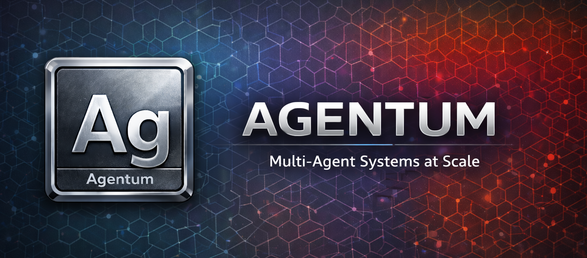

<p align="center">
  
</p>

# Agentum

Agentum enables scalable multi-agent systems by enforcing explicit dynamics on how each agent may modify the system.

Agentum provides the core primitives to compose Agents, Tools, Memory, and Workflows into production-grade systems. It then goes farther, providing explicit control over planning, state, and execution. Complex multi-agent behavior is debuggable, testable, and deterministic where it matters. Agentum keeps large swarms productive with automated validation, triage, and replayable traces when artifacts arrive faster than humans can inspect.

## Core Concepts

**Model** — An async trait (`Box<dyn Model>`) for chat completions. Swap providers at runtime without changing application code.

**Tool** — Define tools the LLM can call by implementing the `Tool` trait with a name, description, JSON schema, and execute method. Register them in a `ToolRegistry` for lookup and dispatch.

**Memory** - Memory gives agents the shared context they need to cooperate, and provides the information you need to understand and evaluate their work.

**Workflow** — DAG-based pipelines where steps run in dependency order. Steps can be agentic (with optional tools) or pure data transformations. Output flows from each step to its dependents.

**Churn** - Churn is the continuous, system-level flow of artifact proposals and state transitions produced by many agents. Agentum's core purpose is to makes churn safe and productive by enforcing explicit dynamics: validation, capability bounds, backpressure, convergence rules, and replayable traces. Agentum allows large swarms to move faster than human review without losing control. 

## Quick Start

```bash
export OPENAI_API_KEY=sk-...
cargo run --example simple_chat
```

### Single LLM Call

```rust
use agentum::{Message, Model, ModelOptions, ModelResponse, OpenAiProvider};

#[tokio::main]
async fn main() -> agentum::Result<()> {
    let provider = OpenAiProvider::from_env("gpt-4o-mini")?;
    let messages = vec![
        Message::system("You are a helpful assistant."),
        Message::user("What is Rust?"),
    ];
    let options = ModelOptions::default();

    match provider.chat(&messages, &options).await? {
        ModelResponse::Text(text) => println!("{text}"),
        ModelResponse::ToolCalls(_) => println!("Unexpected tool calls"),
    }
    Ok(())
}
```

### Tool Calling

```rust
use agentum::{Tool, ToolRegistry, Model, Message, ModelOptions, ModelResponse, OpenAiProvider};
use async_trait::async_trait;

struct Calculator;

#[async_trait]
impl Tool for Calculator {
    fn name(&self) -> &str { "calculator" }
    fn description(&self) -> &str { "Evaluates arithmetic" }
    fn parameters(&self) -> serde_json::Value {
        serde_json::json!({
            "type": "object",
            "properties": { "expression": { "type": "string" } },
            "required": ["expression"]
        })
    }
    async fn execute(&self, args: serde_json::Value) -> agentum::Result<String> {
        let expr = args["expression"].as_str().unwrap_or("0");
        Ok(format!("Result: {expr}"))
    }
}

#[tokio::main]
async fn main() -> agentum::Result<()> {
    let provider = OpenAiProvider::from_env("gpt-4o-mini")?;
    let mut registry = ToolRegistry::new();
    registry.register(Calculator)?;

    let messages = vec![Message::user("What is 2 + 2?")];
    let options = ModelOptions::default();
    let response = provider.chat_with_tools(&messages, &registry.definitions(), &options).await?;

    match response {
        ModelResponse::Text(text) => println!("{text}"),
        ModelResponse::ToolCalls(calls) => {
            let results = registry.dispatch_all(&calls).await?;
            for msg in results {
                println!("{}", msg.content);
            }
        }
    }
    Ok(())
}
```

### Workflow Pipeline

```rust
use agentum::{Model, OpenAiProvider, Workflow};
use serde_json::json;

#[tokio::main]
async fn main() -> agentum::Result<()> {
    let provider = OpenAiProvider::from_env("gpt-4o-mini")?;

    let workflow = Workflow::builder()
        .transform_step("inject", |_inputs| {
            Ok(json!("Rust is a systems programming language."))
        })
        .llm_step("summarize", Box::new(provider), |inputs| {
            let text = inputs["inject"].as_str().unwrap_or("");
            format!("Summarize: {text}")
        }, None)
        .chain(&["inject", "summarize"])
        .build()?;

    let results = workflow.execute().await?;
    println!("{}", results["summarize"]);
    Ok(())
}
```

## Examples

| Example | Run | What it demonstrates |
|---------|-----|----------------------|
| `simple_chat` | `cargo run --example simple_chat` | Single LLM call, message types, response handling |
| `tool_calling` | `cargo run --example tool_calling` | Tool trait, registry, dispatch, both response paths |
| `workflow` | `cargo run --example workflow` | Builder API, DAG execution, data flow between steps |


## License

MIT
